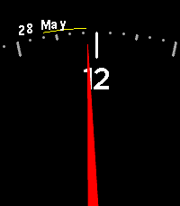

# trichronology
Forked from the elegant Chronology Pebble watchface with a hyper-accurate hour hand that is 
cropped to the current location on the clock's perimiter. But I wanted a triangular hand the resembled an analog speedometer dial, along with date and battery indicators for Pebble Time2
